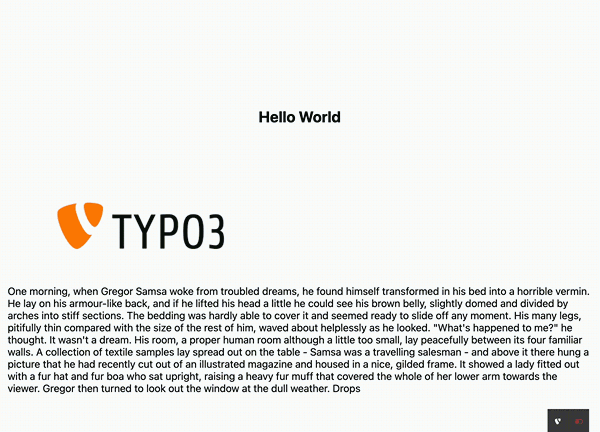
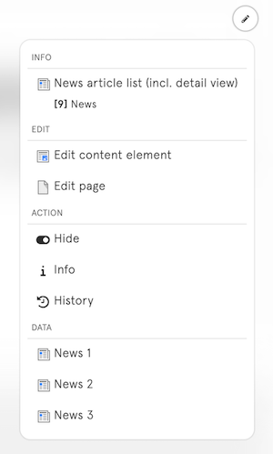

<div align="center">


# TYPO3 extension `xima_typo3_frontend_edit`

[](https://extensions.typo3.org/extension/xima_typo3_frontend_edit)
[](https://get.typo3.org/version/12)
[](https://get.typo3.org/version/13)
[](https://packagist.org/packages/xima/xima-typo3-frontend-edit)

</div>

This extension provides an edit button for editors within frontend content elements.


## Note

> This is **not** a further development of the "original" extension [frontend_editing](https://extensions.typo3.org/extension/frontend_editing). It is similar in some ways to the realisation of the [feedit](https://extensions.typo3.org/extension/feedit) extension. This extension is an independent implementation with a different approach.

The extension has been developed to provide a simple and lightweight solution to easily start the editing of content elements from the frontend and thus reduce the gap between frontend and backend. Therefore a simple javascript is injected into the frontend, which generates action links to the TYPO3 backend with the corresponding edit views.


## Installation

### Composer

``` bash
composer require xima/xima-typo3-frontend-edit
```

### TER

[](https://extensions.typo3.org/extension/xima_typo3_frontend_edit)

Download the zip file from [TYPO3 extension repository (TER)](https://extensions.typo3.org/extension/xima_typo3_frontend_edit).

## Configuration

Include the static TypoScript template "Frontend edit" or directly import it in your sitepackage:

``` typoscript
@import 'EXT:xima_typo3_frontend_edit/Configuration/TypoScript/setup.typoscript'
```

Adjust the constants to restrict the usage of the frontend edit:
``` typoscript
plugin.tx_ximatypo3frontendedit {
  settings {
    ignorePids =
    ignoreCTypes =
    ignoreListTypes =
    ignoreUids =
  }
}
```

Backend user can easily disable the whole frontend edit functionality within their user settings.

*User Settings > Edit and advanced functions > Disable frontend edit*

## How it works

On page load a script calls an ajax endpoint, to fetch information about all editable (by the current backend user) content elements on the current page.

The script then injects (if it's possible) an edit menu into the frontend for each editable content element.

This is __only possible__, if the content element "c-ids" (Content Element IDs) are available in the frontend template, e.g. "c908". By default the fluid styled content elements provide these ids.

```html
<div id="c10" class="frame frame-default frame-type-textpic frame-layout-0">
    ...
</div>
```

The rendered dropdown menu links easily to the corresponding edit views in the TYPO3 backend.

> Hint: The script is only injected if the current backend user is logged in.




## Extend

Two opportunities exists to extend the dropdown menu with custom entries:

1. Use an event to modify the menu directly
2. Use an viewhelper to extend the menu with *data* entries

### Event

Use the `FrontendEditDropdownModifyEvent` to modify the edit menu to your needs. You can add, remove or modify buttons for specific content elements. See the example below:

```php
<?php

declare(strict_types=1);

namespace Vendor\Package\EventListener;

use TYPO3\CMS\Backend\Routing\UriBuilder;
use TYPO3\CMS\Core\Imaging\IconFactory;
use TYPO3\CMS\Core\Utility\GeneralUtility;
use Xima\XimaTypo3FrontendEdit\Enumerations\ButtonType;
use Xima\XimaTypo3FrontendEdit\Event\FrontendEditDropdownModifyEvent;
use Xima\XimaTypo3FrontendEdit\Template\Component\Button;

class ModifyFrontendEditListener
{
    public function __construct(protected readonly IconFactory $iconFactory, protected readonly UriBuilder $uriBuilder)
    {
    }

    public function __invoke(FrontendEditDropdownModifyEvent $event): void
    {
        $contentElement = $event->getContentElement();
        $menuButton = $event->getMenuButton();

        // Example 1
        // Append a custom button (after the existing edit_page button) for your plugin to e.g. edit the referenced entity
        if ($contentElement['CType'] === 'list' && $contentElement['list_type'] === 'custom_plugin_name') {
            $menuButton->appendAfterChild(new Button(
                'Edit entity',
                ButtonType::Link,
                $this->uriBuilder->buildUriFromRoute(
                    'record_edit',
                    [
                        'edit' => [
                            'custom_entity' => [
                                $contentElement['custom_entity_uid'] => 'edit',
                            ],
                        ],
                        'returnUrl' => $event->getReturnUrl(),
                    ],
                )->__toString(),
                $this->iconFactory->getIcon('content-idea', 'small')
            ), 'edit_page', 'edit_custom_entity');
        }

        // Example 2
        // Remove existing buttons
        $menuButton->removeChild('div_action');

        $event->setMenuButton($menuButton);
    }
}
```

### Data Attributes

Additionally, there is an option to extend your fluid template to provide data for extra dropdown menu entries, e.g. edit links to all news entries within a list plugin.

```html
<div class="news-item">
    ...
    <xtfe:data label="{news.title}" uid="{news.uid}" table="tx_news_domain_model_news" icon="content-news" />
</div>
```

This generates a hidden input element with the provided data (only if the frontend edit is enabled). Within the parent content element (e.g. the whole list plugin), a new "data" section will show up on the dropdown menu to list all edit links.



See the [DataViewHelper](Classes/ViewHelpers/DataViewHelper.php) for more information. Keep in mind, that this only works if the parent content element has a c-id and  offer one of the following data combinations:

1. Edit record link (provide `uid` and `table` of the desired record, the link to the TYPO3 backend will be generated automatically)
2. Custom edit url (provide a custom `url`)

> Keep in mind, that this option will add additional html elements to your dom, which can causes style issues.

## FAQ

<details>
<summary>
Missing frontend edit menu
</summary>

*Why is the frontend edit menu not displayed on my page / for my content element?*

There may be a number of reasons for this:

1. __Backend user session__

    Are you currently logged into the TYPO3 backend? Otherwise the frontend edit will not working.
2. __Backend user permission__

   Does your user have all permissions to edit the page as well as the content elements?
3. __TypoScript__

    Is the TypoScript template "Frontend edit" included in your sitepackage? Do you have declared the constants to restrict the usage of the frontend edit?

4. __Content Element IDs__

    Make sure that the content element "c-ids" (Content Element IDs) are available within your frontend template, e.g. "c908".

5. __Content Element on current Page__

   For now only all content elements on the current page are "editable". So if you using some kind of inheritance, e.g. for your footer, this content can't be edited. Maybe I will find a smarter solution for this in the future.

6. __Debug__

   Check the network tab for the initial ajax call (something like `/?tx_ximatypo3frontendedit_frontendedit%5Baction%5D=contentElements&tx_ximatypo3frontendedit_frontendedit%5Bcontroller%5D=Edit&type=1723195241&cHash=...` with the information about the editable content elements and the according dropdown menus.


</details>

## License

This project is licensed
under [GNU General Public License 2.0 (or later)](LICENSE.md).
